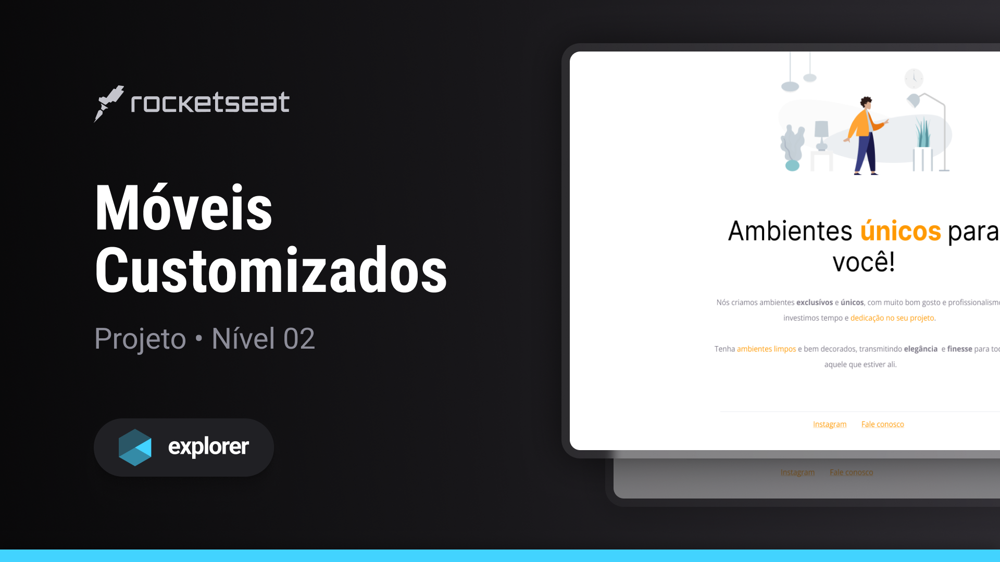

<h1 align="center">Móveis Customizados</h1>

  Projeto retirado do programa Explorer, um programa de estudo exclusivo promovido pela Rocketseat para o ensino de tecnologias web.

  <a href="#-layout">Layout</a>&nbsp;&nbsp;&nbsp;|&nbsp;&nbsp;&nbsp;
  <a href="#-aprendizado">Aprendizado</a>&nbsp;&nbsp;&nbsp;|&nbsp;&nbsp;&nbsp;
  <a href="#-projeto">Projeto</a>&nbsp;&nbsp;&nbsp;|&nbsp;&nbsp;&nbsp;
  <a href="#-tecnologias">Tecnologias</a>&nbsp;&nbsp;&nbsp;|&nbsp;&nbsp;&nbsp;
  <a href="#-licença">Licença</a>

 

  

 

  

## 🎨 Layout

Você pode visualizar o layout do projeto através [DESSE LINK](https://www.figma.com/file/fAvYZz4dPV5MfhL77XkqkD/Explorer---Projeto-01/duplicate).

## 📖 Aprendizado

- Aprendi conceitos básicos de como utilizar o TailwindCSS com eficiência;
- Criação de designs responsivos com o TailwindCSS;
- Uso do gerenciador de pacotes NPM;
- Configuração do arquivo package.json de forma apropriada;
- Melhorei a organização de diretórios.

## 💻 Projeto

Nesse projeto, meu objetivo inicial era corrigir o código que estava completamente quebrado e colocar em prática minhas habilidades em HTML e CSS. No entanto, decidi ir além e implementar o TailwindCSS para melhorar ainda mais a qualidade do código.

## 🧪 Tecnologias

Esse projeto foi desenvolvido com as seguintes tecnologias:

- [HTML](https://developer.mozilla.org/pt-BR/docs/Web/HTML)
- [TailwindCSS](https://tailwindcss.com)
- [NPM](https://www.npmjs.com)
- [Git](https://git-scm.com)
- [Figma](https://www.figma.com)
- [ICONS8](https://icons8.com)

## 📝 Licença

Este projeto está sob a licença MIT. Consulte o arquivo [LICENSE](https://github.com/kauankarvalho/Moveis-Customizados/blob/main/LICENSE) para obter mais detalhes.
